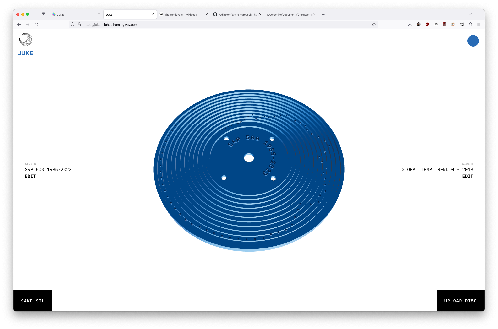

# Juke

Juke is an online STL builder and sharing platform that allows users to create custom music discs for the 1971 Fisher-Price _Music Box - Record Player_.

## Tech Stack

The app itself is built with [Svelte](https://svelte.dev/) + [TS](https://www.typescriptlang.org/) + [Vite](https://vitejs.dev/), using [Threlte](https://threlte.xyz/) for [Threejs](https://threejs.org/) interoperability.

### Server-Side

By virtue of convenience, this is running on a tiny [Olimex A20](https://www.olimex.com/Products/OLinuXino/A20/A20-OLinuXino-LIME/open-source-hardware) in my home office, though Nginx. A small Node server passes requests to MongoDB. This node app is daemonized via [PM2](https://pm2.io/). My home internet connection is no longer static, so random outages may occur, but I endevour to fix that.

### Font Generation
See [FaceType.js](https://gero3.github.io/facetype.js/)